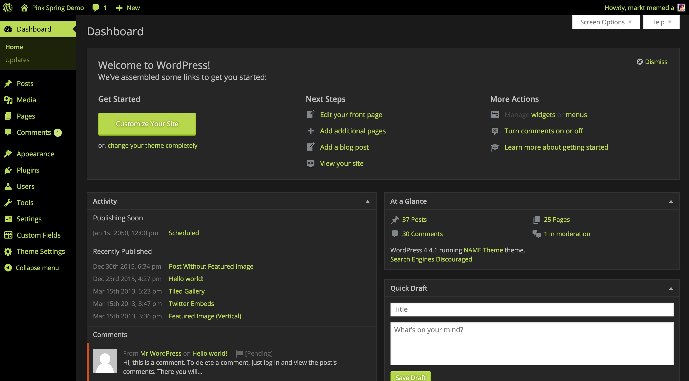

#Super Thorough Admin Color Scheme 
A super-thorough admin color scheme, which happens to be pink. Works as-is without any coding, or great for developers to use to build their own stylesheets!

###Description

Works out of the box (no coding required) to create a warm pink & neutral admin color scheme.

Based on the work by [meabhisek](http://increasy.com/) in the [Romance Color Scheme](https://wordpress.org/plugins/romance-admin-color-scheme/), but extended to cover more of the wp-admin including media upload, focus colors, button colors and text shadows, etc.

Developers: You can use this as a base to create your own color scheme. The plugin will look for a file called `admin-color.css` in the root of your theme or child theme, and comes with `admin-color.scss` for you to edit and compile your own.

###Installation

1. Upload the plugin files to the `/wp-content/plugins/plugin-name` directory, or install the plugin through the WordPress plugins screen directly.
1. Once Super Thorough Admin Color Scheme is installed, activate it via the Plugin page.                 
3. Under `Users > Your Profile`, select Super Thorough in the Admin Color Scheme section and Save.

###Screenshots

This is how your admin will look as soon as you activate it and select the color scheme from your user profile. **No code required!**

This is an example of using admin-color.scss to create a dark color scheme via theme override (the demo css file is included in your resources folder as an example, but additional color schemes are a developer tool, NOT an options interface)

###Changelog

= 1.1.2 =
* More style coverage for widget and menu editors
* Tweaked color balance between different elements
* Reorganize sass files to be somewhat more cohesive
* Update dark theme example

= 1.1.1 =
* More style coverage for media library, media modals, media editor, plugins page, and error color
* Add dark theme example in the resources folder

= 1.1 =
* Add theme override for custom css with admin-color.css and admin-color.scss!
* Targeted additional classes in the admin body so you can create "dark" color schemes

= 1.0.1 =
* Update the hover appearance to behave more like core color schemes
* Target a few more elements that weren't addressed before

= 1.0 =
* Original version! Yay!

###Other Notes

This plugin will look for `admin-color.css` in the root of your theme or child theme, and override the styles used in the plugin itself. It will be a complete override, so you'll need to move the entire file over, otherwise styles will be missing. **This is a developer tool, not an options interface. You'll need to be comfortable writing CSS and/or Sass and adding files to your theme directory.**

**CSS:**
In the Resources folder of the plugin, copy admin-color.css to the root of your theme or child theme, and edit colors as you like.

**SCSS:**
I've provided a Sass file with the necessary variables to make it easier to rapidly create new color schemes. It comes with a relative URL (based on the theme root) to import the other Sass files (mixins and styles) from the plugin itself. Grab that file from the Resources folder and use it to generate your own admin-color.css quickly.